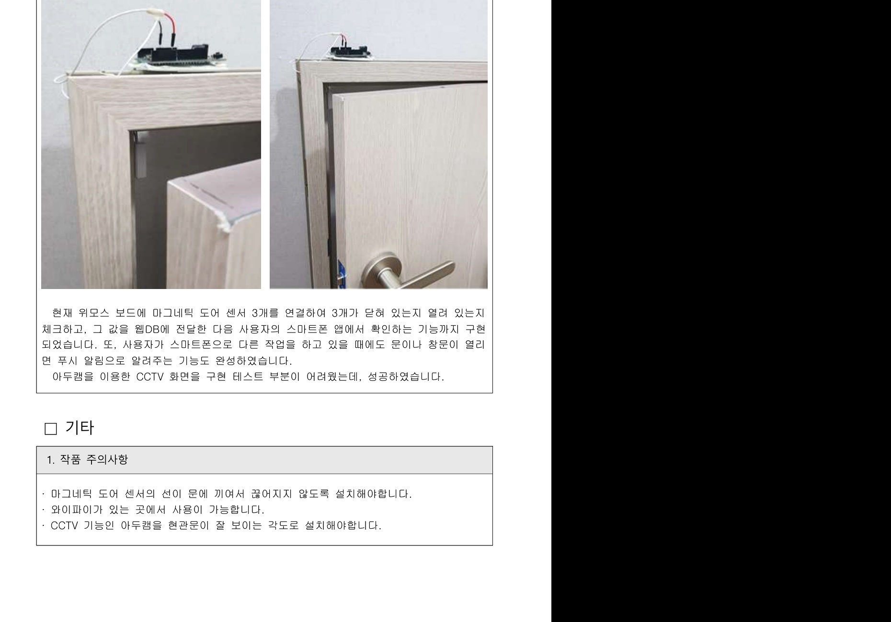
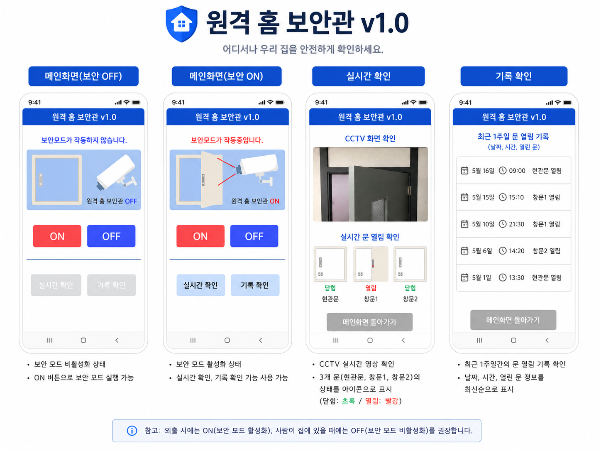
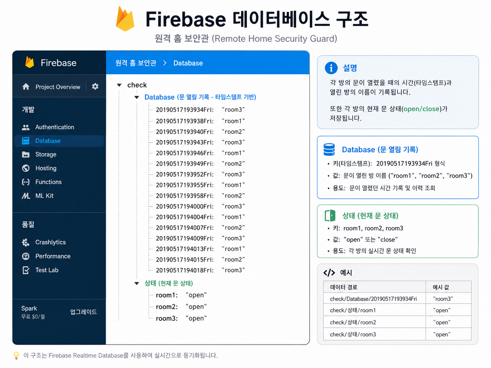
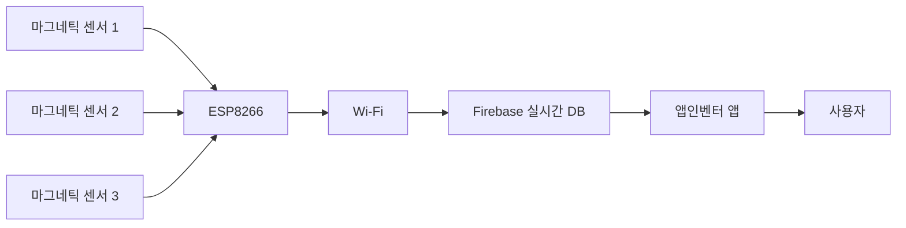
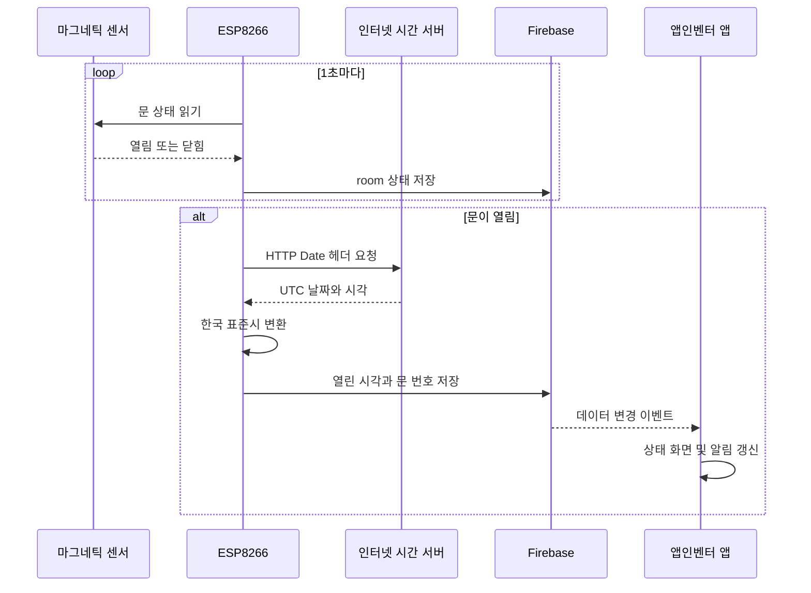
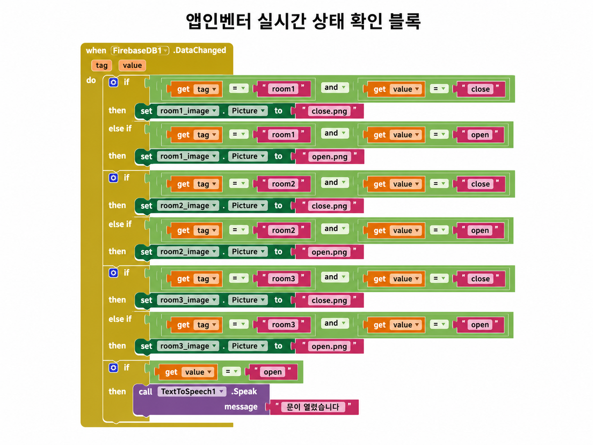
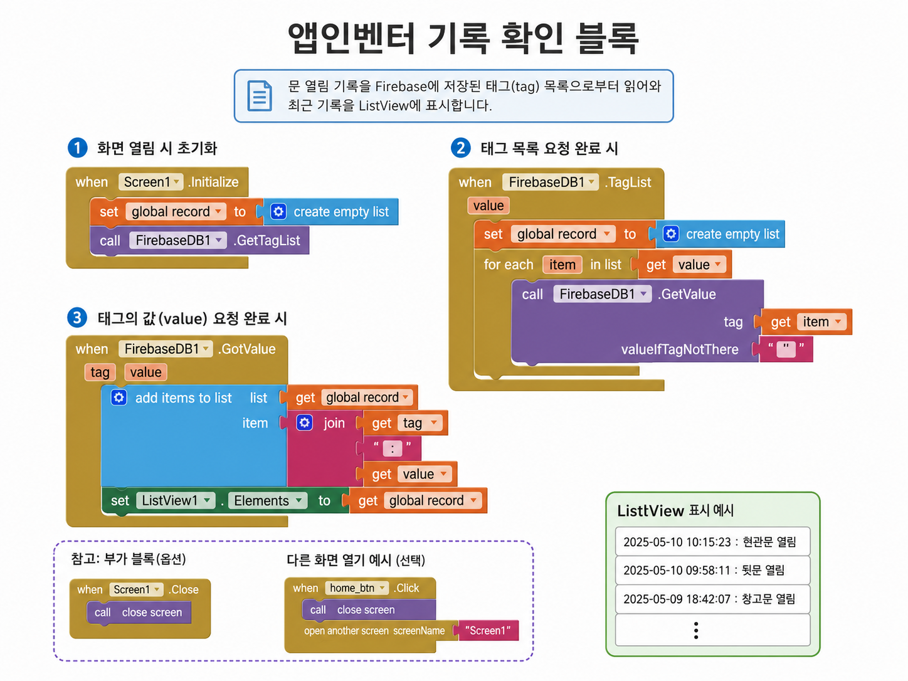
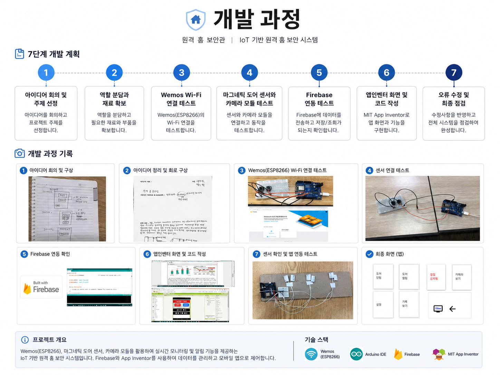

# 원격 홈 보안관

> **2019 한국코드페어 SW를 통한 착한상상 출품작**  
> ESP8266, 마그네틱 도어 센서, Firebase, 앱인벤터를 활용하여 문과 창문의 열림 상태를 원격으로 확인하고 기록하는 가정용 보안 시스템입니다.

<p align="center">
  
</p>

## 프로젝트 개요

| 항목 | 내용 |
|---|---|
| 프로젝트명 | 원격 홈 보안관 |
| 참가 행사 | 2019 한국코드페어 SW를 통한 착한상상 |
| 참가 형태 | 2인 팀 프로젝트 |
| 개발 분야 | 사물인터넷, 임베디드 시스템, 모바일 응용프로그램 |
| 핵심 장치 | ESP8266, 마그네틱 도어 센서 |
| 데이터베이스 | Firebase 실시간 데이터베이스 |
| 모바일 구현 | MIT 앱인벤터 |
| 주요 기능 | 문 열림 감지, 실시간 상태 확인, 열림 시각 기록, 원격 보안 모드 |

## 프로젝트 배경

1인 가구는 집을 비우는 시간이 길고 상대적으로 보안이 취약한 주거 형태에 거주하는 경우가 많습니다. 기존 보안 서비스는 설치 비용과 월 관리비가 발생하기 때문에, 저렴한 부품과 무선 통신을 활용하여 직접 설치할 수 있는 홈 보안 시스템을 제작했습니다.

## 핵심 기능

### 문과 창문 상태 감지

ESP8266의 디지털 입력 핀에 마그네틱 도어 센서 3개를 연결하여 각각의 문 상태를 확인합니다.

| 구분 | 핀 | Firebase 경로 |
|---|---:|---|
| 문 1 | D4 / GPIO2 | `root/room1` |
| 문 2 | D5 / GPIO14 | `root/room2` |
| 문 3 | D6 / GPIO12 | `root/room3` |

센서 값에 따라 다음 상태를 Firebase에 저장합니다.

```text
센서 열림  → open
센서 닫힘  → close
```

### 문 열림 시각 기록

문이 열린 경우 인터넷 서버의 HTTP 응답 헤더에서 날짜와 시간을 가져오고, 한국 표준시로 보정한 뒤 Firebase에 저장합니다.

```text
20190517193934Fri → room3
```

기록 키는 `연월일시분초요일` 형식으로 구성하여 열린 문과 시각을 함께 확인할 수 있도록 구현했습니다.

### 모바일 응용프로그램

앱인벤터로 제작한 모바일 응용프로그램에서 다음 기능을 제공합니다.

- 보안 모드 켜기 및 끄기
- 3개 문의 실시간 열림·닫힘 상태 확인
- 최근 문 열림 기록 확인
- CCTV 화면 확인
- 문 열림 알림

<p align="center">
  
</p>

### Firebase 실시간 연동

ESP8266은 각 문의 상태와 문이 열린 시각을 Firebase 실시간 데이터베이스에 저장합니다. 앱인벤터의 `DataChanged` 이벤트는 데이터 변경을 감지해 문 상태 이미지를 즉시 변경합니다.

<p align="center">
  
</p>

## 시스템 구조



## 데이터 처리 흐름



## 앱인벤터 구현

### 실시간 상태 반영

Firebase의 데이터가 변경되면 방 번호와 상태값을 비교하여 문 이미지를 열림 또는 닫힘 상태로 변경합니다.

<p align="center">
  
</p>

### 기록 확인

Firebase의 태그 목록을 불러온 뒤 각 값을 조회하여 최근 문 열림 기록을 목록에 표시합니다.

<p align="center">
  
</p>

## 하드웨어 시제품

문 모형에 마그네틱 도어 센서를 설치하고 ESP8266과 연결하여 실제 문 개폐 상태를 감지했습니다.

<p align="center">
  
</p>

## 개발 과정

<p align="center">
  
</p>

| 단계 | 진행 내용 |
|---|---|
| 1단계 | 아이디어 회의, 주제 선정, 실현 가능성 검토 |
| 2단계 | 역할 분담, 재료 확보, 기초 계획서 작성 |
| 3단계 | ESP8266 무선 연결 및 디지털 입력 테스트 |
| 4단계 | 마그네틱 도어 센서와 카메라 모듈 테스트 |
| 5단계 | Firebase 데이터 송수신 구현 |
| 6단계 | 앱인벤터 화면 및 기능 구현 |
| 7단계 | 오류 수정, 시제품 통합 및 최종 테스트 |

## 사용 기술

### 하드웨어

- ESP8266 기반 Wemos 보드
- 마그네틱 도어 센서 3개
- ArduCAM 카메라 모듈
- 브레드보드
- 점퍼선
- 문 모형

### 소프트웨어

- Arduino IDE
- Arduino C/C++
- Firebase 실시간 데이터베이스
- MIT 앱인벤터
- Wi-Fi 및 HTTP 통신

### 라이브러리

```cpp
#include <ArduinoJson.h>
#include <SimpleTimer.h>
#include <ESP8266WiFi.h>
#include <FirebaseArduino.h>
```

## 주요 코드 구조

### 주기적 센서 확인

`SimpleTimer`를 이용하여 세 문의 상태를 각각 1초 간격으로 확인합니다.

```cpp
t1.setInterval(1000, fn1);
t2.setInterval(1000, fn2);
t3.setInterval(1000, fn3);
```

### 상태 저장

```cpp
String room_name = "root/" + room;
Firebase.setString(room_name, str);
```

### 열린 시각 저장

```cpp
String date_time = "root/" + open_time;
Firebase.setString(date_time, room);
```

## 실행 방법

1. Arduino IDE에 ESP8266 보드 환경을 설치합니다.
2. 필요한 라이브러리를 설치합니다.
3. Firebase 프로젝트와 실시간 데이터베이스를 생성합니다.
4. 소스 코드의 환경 변수에 개인 설정을 입력합니다.

```cpp
#define FIREBASE_HOST "YOUR_FIREBASE_HOST"
#define FIREBASE_AUTH "YOUR_FIREBASE_AUTH"
#define WIFI_SSID "YOUR_WIFI_SSID"
#define WIFI_PASSWORD "YOUR_WIFI_PASSWORD"
```

5. ESP8266에 코드를 업로드합니다.
6. 마그네틱 도어 센서를 D4, D5, D6 핀에 연결합니다.
7. `src/remotesecurity.aia` 파일을 MIT 앱인벤터에 가져옵니다.
8. 앱인벤터의 Firebase 설정을 본인의 프로젝트에 맞게 변경합니다.

## 저장소 구조

```text
.
├── README.md
├── src
│   ├── remote_home_security.ino
│   └── remotesecurity.aia
└── docs
    ├── 원격 홈 보안관.pdf
    └── images
        ├── app-screens.png
        ├── development-process.png
        ├── door-prototype.jpg
        ├── firebase-database.png
        ├── appinventor-realtime.png
        └── appinventor-record.png
```

## 개발 결과

- 마그네틱 센서 3개의 열림·닫힘 상태 감지
- ESP8266과 Firebase 실시간 연동
- 문이 열린 날짜와 시각 기록
- 앱인벤터에서 문의 실시간 상태 확인
- 최근 문 열림 기록 조회
- 모바일 알림 기능 구현
- ArduCAM을 활용한 CCTV 화면 확인 기능 테스트
- 실제 문 모형을 통한 통합 시연

## 기술적 회고

### 잘된 점

- 센서 입력부터 클라우드 저장, 모바일 화면 반영까지 전체 사물인터넷 구조를 구현했습니다.
- 여러 센서를 독립적으로 주기 확인하도록 구성했습니다.
- 문의 현재 상태뿐만 아니라 열린 시각까지 기록했습니다.
- 앱인벤터를 활용하여 실시간 상태와 기록 확인 화면을 구현했습니다.
- 실제 문 모형을 제작해 시스템의 동작을 시연했습니다.

### 개선할 점

- Firebase 인증키와 무선망 정보를 코드에서 분리
- 인터넷 서버의 HTTP Date 헤더 대신 NTP 사용
- `delay()`를 제거하고 비차단 구조로 개선
- 문이 열린 상태에서 같은 기록이 매초 반복 저장되지 않도록 상태 변화 감지 추가
- Firebase의 최신 라이브러리와 보안 규칙 적용
- 카메라 영상 인증과 접근 제어 추가
- 센서 연결 오류 및 네트워크 재접속 처리
- 앱 화면과 데이터 구조의 유지보수성 개선

## 보안 주의사항

```cpp
#define FIREBASE_HOST "YOUR_FIREBASE_HOST"
#define FIREBASE_AUTH "YOUR_FIREBASE_AUTH"
#define WIFI_SSID "YOUR_WIFI_SSID"
#define WIFI_PASSWORD "YOUR_WIFI_PASSWORD"
```

## 관련 자료

- [앱인벤터 프로젝트](src/remotesecurity.aia)
- [작품 설명서](docs/원격%20홈%20보안관.pdf)
